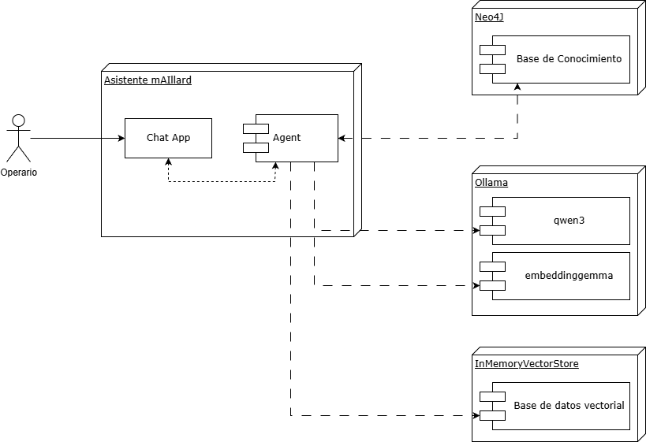
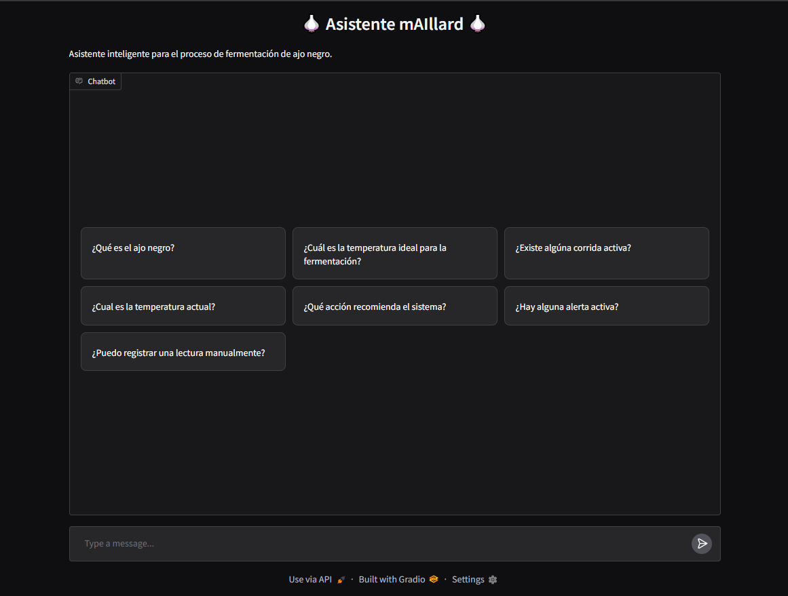
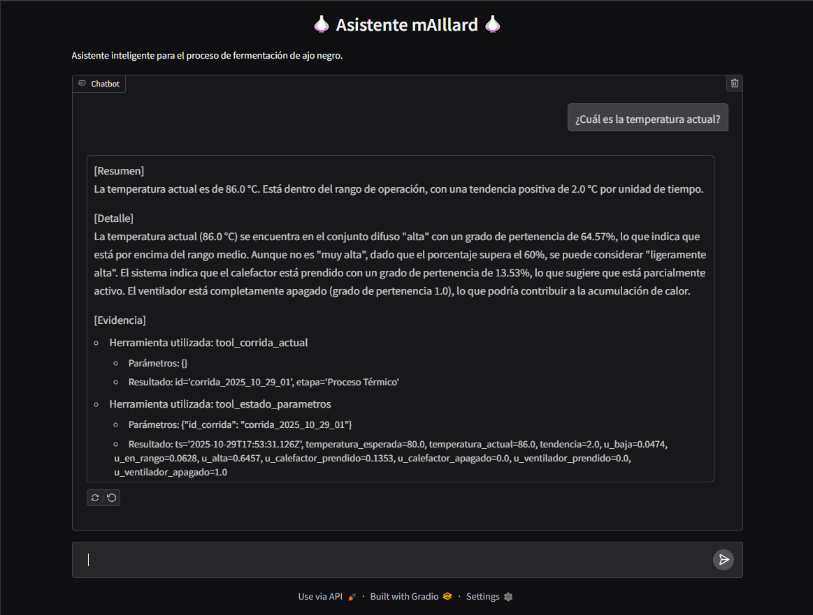

# Informe Ejecutivo - Sistema experto para el proceso de ajo negro

## Tabla de contenidos
- [Introducción](#introducción)
- [Objetivos](#objetivos)
	- [Objetivo general](#objetivo-general)
	- [Objetivos específicos](#objetivos-específicos)
- [Módulos](#módulos)
	- [Base de conocimiento](#base-de-conocimiento)
	- [Modelo de lenguaje de gran escala (LLM)](#modelo-de-lenguaje-de-gran-escala-llm)
	- [Aplicación Chat](#aplicación-chat)
- [Resultados obtenidos](#resultados-obtenidos)
- [Limitaciones y próximos pasos](#limitaciones-y-próximos-pasos)
- [Lecciones aprendidas](#lecciones-aprendidas)
- [Documentación técnica](#documentación-técnica)

## Introducción

El ajo negro es el producto resultante del envejecimiento térmico del ajo fresco (Allium sativum L.) mediante un proceso controlado de temperatura y humedad que transforma las características físicas, químicas y organolépticas del ajo blanco convencional. Contrario a lo que sugiere el término "fermentación", este proceso no es una verdadera fermentación microbiana, sino una transformación química compleja que involucra principalmente la reacción de Maillard y otros procesos de oxidación.

En este contexto, se desarrolló un sistema experto para el análisis de la situación actual y la recomendación de acciones en el proceso de fermentación de ajo negro. El proyecto combina técnicas clásicas de inteligencia artificial, como redes semánticas, marcos y reglas lógicas de inferencia, con herramientas contemporáneas basadas en modelos de lenguaje (LLM), para ofrecer un entorno de consulta natural y explicativo.

El resultado es un prototipo funcional que asiste al operador en la supervisión del proceso, identifica desviaciones de temperatura y sugiere acciones correctivas, combinando razonamiento y procesamiento del lenguaje natural.
Este informe recorre el proceso de desarrollo de la herramienta mencionada, revisando sus módulos, resultados obtenidos y próximos pasos.

## Objetivos

### Objetivo general

Desarrollar un sistema experto capaz de analizar el estado del proceso, inferir nuevas condiciones a partir de reglas de conocimiento y recomendar acciones al operador mediante una interfaz conversacional.

### Objetivos específicos

- Modelar el conocimiento del dominio e implementarlo en una base de conocimiento en Neo4J.
- Diseñar un agente inteligente que integre la base de conocimiento con un LLM ejecutado en Ollama.
- Desarrollar una interfaz conversacional que permita al operario realizar consultas en lenguaje natural y recibir respuestas explicativas y contextualizadas.
- Identificar limitaciones y oportunidades de mejora, con foco en la escalabilidad del modelo.

## Módulos

El proyecto se organizó en tres módulos principales que, de manera integrada, conforman el flujo completo de adquisición, razonamiento e interacción con el usuario. Cada integrante del equipo compartió la responsabilidad del desarrollo de los módulos, fomentando un ambiente colaborativo.

### Base de conocimiento

La base de conocimiento es el componente principal del sistema, el que mantiene los hechos y las reglas lógicas de inferencia.

La base de conocimiento se construyó en etapas, comenzando por diagramar la red semántica que representa el conocimiento del dominio, luego transformándola en una red de marcos, permitiendo estructurar jerarquía de conceptos, atributos y reglas asociadas, para posteriormente implementarlo en Neo4j.

En esta base de datos, se aplicaron triggers de apoc, plugin de Neo4j, para ejecutar inferencias automáticas en base a eventos del sistema, por ejemplo, detectar si la tendencia actual excede el umbral definido, generando una nueva Alerta. De este modo, el sistema mantiene actualizado el conocimiento sin intervención humana directa.

### Modelo de lenguaje de gran escala (LLM)

El segundo módulo integra el razonamiento simbólico con un componente de procesamiento de lenguaje natural. 

Se implementó un agente con la librería _**LangChain**_ que integra la base de conocimiento y el modelo de lenguaje desplegado localmente mediante _**Ollama**_. Este agente gestiona las consultas del usuario, selecciona las herramientas adecuadas, y construye una respuesta coherente y explicativa.

El modelo utilizado fue _qwen3:4b-instruct_, acompañado del modelo _embeddinggemma_ para la búsqueda semántica y la recuperación aumentada del conocimiento (RAG). De esta manera el sistema combina inferencia basada en reglas con razonamiento probabilístico y comprensión contextual, logrando respuestas más precisas y naturales.

### Aplicación Chat

El tercer y último módulo corresponde a la capa de interacción con el usuario, donde se construyó una interfaz conversacional en Python, utilizando la librería Gradio, que permite al usuario realizar consultas en lenguaje natural sobre el proceso del ajo negro.

La interfaz ofrece un entorno intuitivo en el que el operador puede, por ejemplo, preguntar “¿La temperatura actual es adecuada?”, recibiendo respuestas argumentadas y fundamentadas en la base de conocimiento.

Figura 1: Diagrama de Módulos

## Resultados obtenidos

El sistema experto desarrollado alcanzó un nivel de funcionamiento estable y demostrable en los tres componentes principales. La integración permitió validar la coherencia de las inferencias, la conectividad entre módulos y la generación de respuestas contextualizadas ante consultas del operador.

Figura 2: Asistente mAIllard

Desde esta interfaz, el operario puede realizar las siguientes consultas:
- Solicitar información general del ajo negro y el proceso de fermentación: Esta consulta será contestada utilizando los documentos vectorizados en la base de datos vectorial utilizando RAG.
- Consultar corrida en curso: Brindará información sobre si existe una corrida en curso y su etapa actual.
- Consultar el estado de los parámetros: Contestará el estado actual de la variable de temperatura y el estado del calefactor y ventilador, en caso que exista una corrida activa. Además, clasificará el estado de la temperatura según el valor esperado para la etapa en curso.
- Consultar recomendaciones: Buscará las acciones recomendadas por el sistema experto en base al estado actual de los parámetros.
- Consultar alertas: Devolverá eventos de alerta en caso de existir.
- Registrar una lectura de manera manual: Permitirá al operario cargar una lectura de temperatura y tendencia, enviando los datos en la consulta.

Figura 3: Consulta de temperatura actual (insertar captura aquí)

## Limitaciones y próximos pasos

El resultado de este desarrollo es un primer prototipo funcional acotado que sólo se enfoca en el subproceso de análisis de la situación actual y recomendación de acciones, contemplando un único parámetro que es la temperatura, dejando afuera parámetros como la humedad relativa, la calidad de aire, el pH, entre otros.

Asimismo, se detecta como principal limitación la capacidad de procesamiento de los modelos desplegados de manera local, haciendo que el tiempo de respuesta dependa de los recursos asignados al modelo y del nivel de carga del sistema en un momento determinado. 

Otra limitación que el sistema posee es la utilización de una base de datos vectorial en memoria, decisión tomada en pos de la simplicidad del desarrollo. Esta base de datos vectorial es efímera, y se recrea al momento de ejecutar la aplicación.

En este orden de ideas, los próximos pasos para extender el sistema serían el modelado e incorporación de los parámetros faltantes (humedad relativa, calidad de aire, pH), modificando las reglas lógicas implementadas y la incorporación de nuevas funcionalidades relacionadas al subproceso.

Esta extensión es posible debido al diseño modular elegido durante el desarrollo del sistema, donde se definió una arquitectura de la base de conocimiento y del agente LLM para que pueda ser lo suficientemente flexible como para incorporar nuevos elementos y funcionalidades.

En cuanto a las limitaciones, las próximas tareas para mejorar el sistema serían el reemplazo del modelo local por algún modelo comercialmente disponible, cambio que requeriría una inversión monetaria, y la incorporación de una base de datos vectorial persistente, como ChromaDB.

## Lecciones aprendidas

A partir de este proyecto, hemos podido aprender a trabajar de manera colaborativa en el contexto del desarrollo de un sistema experto, utilizando herramientas que no habíamos utilizado al momento en la carrera.

Por otro lado, hemos tenido que investigar, probar y aprender acerca de los mejores modelos para implementar en nuestro contexto, como así también descubrir las mejores configuraciones que permitían al modelo comportarse de la manera más óptima con los recursos disponibles.

Finalmente, esta fue una buena experiencia para reforzar la práctica de creación de prompt, ya que hemos tenido que armar, probar e iterar sobre el prompt utilizado, de forma tal de reducir alucinaciones y mejorar la fidelidad de las respuestas del modelo.

## Documentación técnica

Para información detallada de cada módulo, consulte las siguientes fichas técnicas:

- [Red de Procesos - Sistema Experto](docs/red_de_procesos_sistema_experto/FICHA_TECNICA.md)
- [Red Semántica - Modelo Conceptual](docs/red_semantica_modelo_conceptual/FICHA_TECNICA.md)
- [Red de Frames Difusos - Modelo Lógico](docs/red_de_frames_difusos_modelo_logico/FICHA_TECNICA.md)
- [Base Orientada a Grafos - Neo4j](docs/base_orientada_a_grafos_neo4j/FICHA_TECNICA.md)
- [Integración Módulo Generativo - Ollama & LangChain](docs/integracion_modulo_generativo_ollama_langchain/FICHA_TECNICA.md)
- [API del Asistente Inteligente](docs/api_del_asistente_inteligente/FICHA_TECNICA.md)

Para una descripción general de la documentación, consulte el [índice principal](docs/README.md).