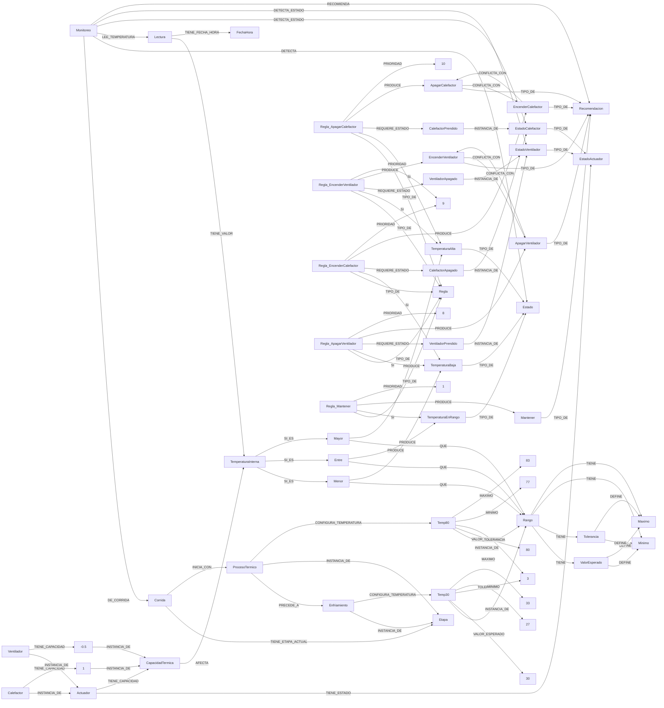

```mermaid
flowchart LR

%% Proceso y Etapas
corr["Corrida"]
etapa["Etapa"]
procT["ProcesoTermico"]
enf["Enfriamiento"]

corr -- "TIENE_ETAPA_ACTUAL" --> etapa
corr -- "INICIA_CON" --> procT
procT -- "PRECEDE_A" --> enf
procT -- "INSTANCIA_DE" --> etapa
enf -- "INSTANCIA_DE" --> etapa

%% Rangos
rango["Rango"]
valExp["ValorEsperado"]
tol["Tolerancia"]
minv["Minimo"]
maxv["Maximo"]

rango -- "TIENE" --> valExp
rango -- "TIENE" --> tol
rango -- "TIENE" --> minv
rango -- "TIENE" --> maxv
valExp -- "DEFINE" --> minv
valExp -- "DEFINE" --> maxv
tol -- "DEFINE" --> minv
tol -- "DEFINE" --> maxv

temp80["Temp80"]
v80["80"]
v3["3"]
v77["77"]
v83["83"]
temp30["Temp30"]
v30["30"]
v27["27"]
v33["33"]

temp80 -- "INSTANCIA_DE" --> rango
temp80 -- "VALOR_ESPERADO" --> v80
temp80 -- "TOLERANCIA" --> v3
temp80 -- "MINIMO" --> v77
temp80 -- "MAXIMO" --> v83
procT -- "CONFIGURA_TEMPERATURA" --> temp80

temp30 -- "INSTANCIA_DE" --> rango
temp30 -- "VALOR_ESPERADO" --> v30
temp30 -- "TOLERANCIA" --> v3
temp30 -- "MINIMO" --> v27
temp30 -- "MAXIMO" --> v33
enf -- "CONFIGURA_TEMPERATURA" --> temp30

%% Monitoreo y Lecturas
mon["Monitoreo"]
estado["Estado"]
lec["Lectura"]
tempInt["TemperaturaInterna"]
fechaHora["FechaHora"]
estCal["EstadoCalefactor"]
estVen["EstadoVentilador"]

mon -- "DE_CORRIDA" --> corr
mon -- "DETECTA" --> estado
mon -- "LEE_TEMPERATURA" --> lec
mon -- "DETECTA_ESTADO" --> estCal
mon -- "DETECTA_ESTADO" --> estVen
lec -- "TIENE_VALOR" --> tempInt
lec -- "TIENE_FECHA_HORA" --> fechaHora

%% Estados térmicos y comparadores
tAlta["TemperaturaAlta"]
tBaja["TemperaturaBaja"]
tRango["TemperaturaEnRango"]
menor["Menor"]
entre["Entre"]
mayor["Mayor"]

tAlta -- "TIPO_DE" --> estado
tBaja -- "TIPO_DE" --> estado
tRango -- "TIPO_DE" --> estado

tempInt -- "SI_ES" --> menor
menor -- "QUE" --> rango
menor -- "PRODUCE" --> tBaja

tempInt -- "SI_ES" --> entre
entre -- "QUE" --> rango
entre -- "PRODUCE" --> tRango

tempInt -- "SI_ES" --> mayor
mayor -- "QUE" --> rango
mayor -- "PRODUCE" --> tAlta

%% Actuadores y capacidades
act["Actuador"]
estAct["EstadoActuador"]
capT["CapacidadTermica"]
calef["Calefactor"]
vent["Ventilador"]
v1["1"]
vm05["-0.5"]
calPr["CalefactorPrendido"]
calAp["CalefactorApagado"]
venPr["VentiladorPrendido"]
venAp["VentiladorApagado"]

act -- "TIENE_ESTADO" --> estAct
act -- "TIENE_CAPACIDAD" --> capT
estCal -- "TIPO_DE" --> estAct
estVen -- "TIPO_DE" --> estAct
capT -- "AFECTA" --> tempInt

calef -- "INSTANCIA_DE" --> act
v1 -- "INSTANCIA_DE" --> capT
calef -- "TIENE_CAPACIDAD" --> v1
calPr -- "INSTANCIA_DE" --> estCal
calAp -- "INSTANCIA_DE" --> estCal

vent -- "INSTANCIA_DE" --> act
vm05 -- "INSTANCIA_DE" --> capT
vent -- "TIENE_CAPACIDAD" --> vm05
venPr -- "INSTANCIA_DE" --> estVen
venAp -- "INSTANCIA_DE" --> estVen

%% Recomendaciones
rec["Recomendacion"]
apCal["ApagarCalefactor"]
enCal["EncenderCalefactor"]
enVen["EncenderVentilador"]
apVen["ApagarVentilador"]
mant["Mantener"]

apCal -- "TIPO_DE" --> rec
enCal -- "TIPO_DE" --> rec
enVen -- "TIPO_DE" --> rec
apVen -- "TIPO_DE" --> rec
mant -- "TIPO_DE" --> rec
mon -- "RECOMIENDA" --> rec

%% Reglas de control
regla["Regla"]
rApCal["Regla_ApagarCalefactor"]
rEnVen["Regla_EncenderVentilador"]
rEnCal["Regla_EncenderCalefactor"]
rApVen["Regla_ApagarVentilador"]
rMant["Regla_Mantener"]
p10["10"]
p9["9"]
p8["8"]
p1["1"]

rApCal -- "TIPO_DE" --> regla
rApCal -- "SI" --> tAlta
rApCal -- "REQUIERE_ESTADO" --> calPr
rApCal -- "PRODUCE" --> apCal
rApCal -- "PRIORIDAD" --> p10

rEnVen -- "TIPO_DE" --> regla
rEnVen -- "SI" --> tAlta
rEnVen -- "REQUIERE_ESTADO" --> venAp
rEnVen -- "PRODUCE" --> enVen
rEnVen -- "PRIORIDAD" --> p9

rEnCal -- "TIPO_DE" --> regla
rEnCal -- "SI" --> tBaja
rEnCal -- "REQUIERE_ESTADO" --> calAp
rEnCal -- "PRODUCE" --> enCal
rEnCal -- "PRIORIDAD" --> p9

rApVen -- "TIPO_DE" --> regla
rApVen -- "SI" --> tBaja
rApVen -- "REQUIERE_ESTADO" --> venPr
rApVen -- "PRODUCE" --> apVen
rApVen -- "PRIORIDAD" --> p8

rMant -- "TIPO_DE" --> regla
rMant -- "SI" --> tRango
rMant -- "PRODUCE" --> mant
rMant -- "PRIORIDAD" --> p1

%% Conflictos
apCal -- "CONFLICTA_CON" --> enCal
enCal -- "CONFLICTA_CON" --> apCal
apVen -- "CONFLICTA_CON" --> enVen
enVen -- "CONFLICTA_CON" --> apVen
```