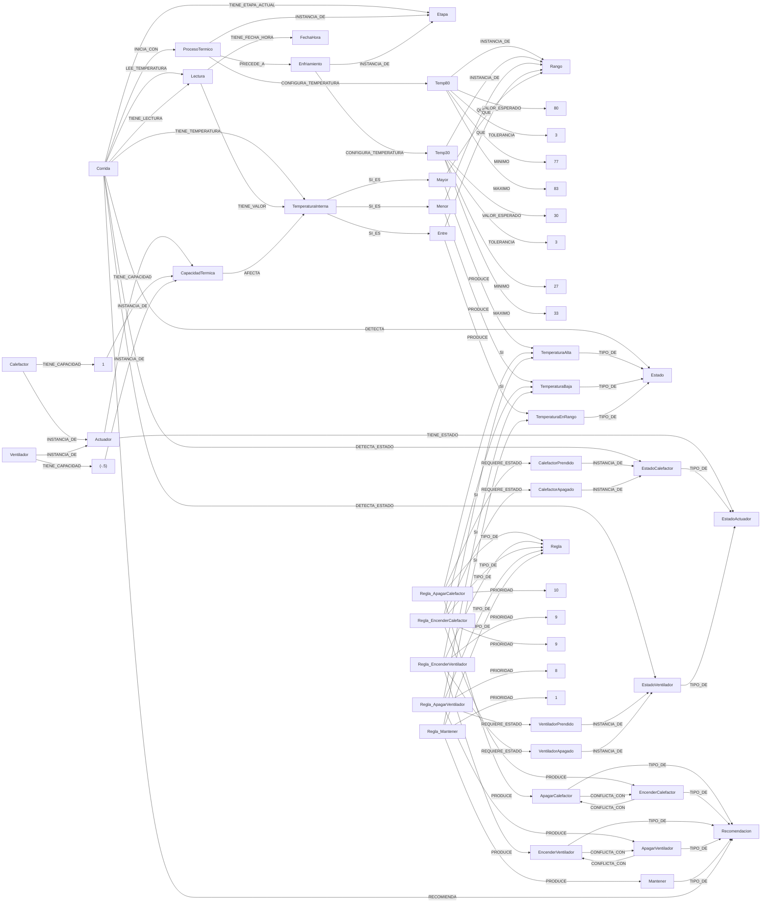

```mermaid
flowchart LR

%% ========== ETAPAS / RANGOS ==========
Corrida["Corrida"] -- "TIENE_ETAPA_ACTUAL" --> Etapa["Etapa"]

ProcesoTermico["ProcesoTermico"] -- "INSTANCIA_DE" --> Etapa
Temp80["Temp80"] -- "INSTANCIA_DE" --> Rango["Rango"]
Temp80 -- "VALOR_ESPERADO" --> v80["80"]
Temp80 -- "TOLERANCIA" --> v3a["3"]
Temp80 -- "MINIMO" --> v77["77"]
Temp80 -- "MAXIMO" --> v83["83"]
ProcesoTermico -- "CONFIGURA_TEMPERATURA" --> Temp80

Enfriamiento["Enfriamiento"] -- "INSTANCIA_DE" --> Etapa
Temp30["Temp30"] -- "INSTANCIA_DE" --> Rango
Temp30 -- "VALOR_ESPERADO" --> v30["30"]
Temp30 -- "TOLERANCIA" --> v3b["3"]
Temp30 -- "MINIMO" --> v27["27"]
Temp30 -- "MAXIMO" --> v33["33"]
Enfriamiento -- "CONFIGURA_TEMPERATURA" --> Temp30

Corrida -- "INICIA_CON" --> ProcesoTermico
ProcesoTermico -- "PRECEDE_A" --> Enfriamiento

%% ========== LECTURAS / MEDICIÓN ==========
Corrida -- "DETECTA" --> Estado["Estado"]
Corrida -- "LEE_TEMPERATURA" --> Lectura["Lectura"]
Corrida -- "DETECTA_ESTADO" --> EstadoCalefactor["EstadoCalefactor"]
Corrida -- "DETECTA_ESTADO" --> EstadoVentilador["EstadoVentilador"]
Corrida -- "TIENE_LECTURA" --> Lectura
Corrida -- "TIENE_TEMPERATURA" --> TemperaturaInterna["TemperaturaInterna"]
Lectura -- "TIENE_VALOR" --> TemperaturaInterna
Lectura -- "TIENE_FECHA_HORA" --> FechaHora["FechaHora"]

%% ========== ESTADOS DE TEMPERATURA ==========
TemperaturaAlta["TemperaturaAlta"] -- "TIPO_DE" --> Estado
TemperaturaBaja["TemperaturaBaja"] -- "TIPO_DE" --> Estado
TemperaturaEnRango["TemperaturaEnRango"] -- "TIPO_DE" --> Estado

%% ========== REGLAS DIAGNÓSTICO (COMPARADORES) ==========
TemperaturaInterna -- "SI_ES" --> Menor["Menor"]
Menor -- "QUE" --> Rango
Menor -- "PRODUCE" --> TemperaturaBaja

TemperaturaInterna -- "SI_ES" --> Entre["Entre"]
Entre -- "QUE" --> Rango
Entre -- "PRODUCE" --> TemperaturaEnRango

TemperaturaInterna -- "SI_ES" --> Mayor["Mayor"]
Mayor -- "QUE" --> Rango
Mayor -- "PRODUCE" --> TemperaturaAlta

%% ========== ACTUADORES ==========
Actuador["Actuador"] -- "TIENE_ESTADO" --> EstadoActuador["EstadoActuador"]
Actuador -- "TIENE_CAPACIDAD" --> CapacidadTermica["CapacidadTermica"]
EstadoCalefactor -- "TIPO_DE" --> EstadoActuador
EstadoVentilador -- "TIPO_DE" --> EstadoActuador
CapacidadTermica -- "AFECTA" --> TemperaturaInterna

Calefactor["Calefactor"] -- "INSTANCIA_DE" --> Actuador
cap1["1"] -- "INSTANCIA_DE" --> CapacidadTermica
Calefactor -- "TIENE_CAPACIDAD" --> cap1
CalefactorPrendido["CalefactorPrendido"] -- "INSTANCIA_DE" --> EstadoCalefactor
CalefactorApagado["CalefactorApagado"] -- "INSTANCIA_DE" --> EstadoCalefactor

Ventilador["Ventilador"] -- "INSTANCIA_DE" --> Actuador
capNeg05["(-.5)"] -- "INSTANCIA_DE" --> CapacidadTermica
Ventilador -- "TIENE_CAPACIDAD" --> capNeg05
VentiladorPrendido["VentiladorPrendido"] -- "INSTANCIA_DE" --> EstadoVentilador
VentiladorApagado["VentiladorApagado"] -- "INSTANCIA_DE" --> EstadoVentilador

%% ========== RECOMENDACIONES ==========
ApagarCalefactor["ApagarCalefactor"] -- "TIPO_DE" --> Recomendacion["Recomendacion"]
EncenderCalefactor["EncenderCalefactor"] -- "TIPO_DE" --> Recomendacion
EncenderVentilador["EncenderVentilador"] -- "TIPO_DE" --> Recomendacion
ApagarVentilador["ApagarVentilador"] -- "TIPO_DE" --> Recomendacion
Mantener["Mantener"] -- "TIPO_DE" --> Recomendacion

Corrida -- "RECOMIENDA" --> Recomendacion

%% ========== REGLAS DE CONTROL ==========
Regla_ApagarCalefactor["Regla_ApagarCalefactor"] -- "TIPO_DE" --> Regla["Regla"]
Regla_ApagarCalefactor -- "SI" --> TemperaturaAlta
Regla_ApagarCalefactor -- "REQUIERE_ESTADO" --> CalefactorPrendido
Regla_ApagarCalefactor -- "PRODUCE" --> ApagarCalefactor
Regla_ApagarCalefactor -- "PRIORIDAD" --> prio10["10"]

Regla_EncenderVentilador["Regla_EncenderVentilador"] -- "TIPO_DE" --> Regla
Regla_EncenderVentilador -- "SI" --> TemperaturaAlta
Regla_EncenderVentilador -- "REQUIERE_ESTADO" --> VentiladorApagado
Regla_EncenderVentilador -- "PRODUCE" --> EncenderVentilador
Regla_EncenderVentilador -- "PRIORIDAD" --> prio9a["9"]

Regla_EncenderCalefactor["Regla_EncenderCalefactor"] -- "TIPO_DE" --> Regla
Regla_EncenderCalefactor -- "SI" --> TemperaturaBaja
Regla_EncenderCalefactor -- "REQUIERE_ESTADO" --> CalefactorApagado
Regla_EncenderCalefactor -- "PRODUCE" --> EncenderCalefactor
Regla_EncenderCalefactor -- "PRIORIDAD" --> prio9b["9"]

Regla_ApagarVentilador["Regla_ApagarVentilador"] -- "TIPO_DE" --> Regla
Regla_ApagarVentilador -- "SI" --> TemperaturaBaja
Regla_ApagarVentilador -- "REQUIERE_ESTADO" --> VentiladorPrendido
Regla_ApagarVentilador -- "PRODUCE" --> ApagarVentilador
Regla_ApagarVentilador -- "PRIORIDAD" --> prio8["8"]

Regla_Mantener["Regla_Mantener"] -- "TIPO_DE" --> Regla
Regla_Mantener -- "SI" --> TemperaturaEnRango
Regla_Mantener -- "PRODUCE" --> Mantener
Regla_Mantener -- "PRIORIDAD" --> prio1["1"]

%% ========== CONFLICTOS ==========
ApagarCalefactor -- "CONFLICTA_CON" --> EncenderCalefactor
EncenderCalefactor -- "CONFLICTA_CON" --> ApagarCalefactor
ApagarVentilador -- "CONFLICTA_CON" --> EncenderVentilador
EncenderVentilador -- "CONFLICTA_CON" --> ApagarVentilador
```