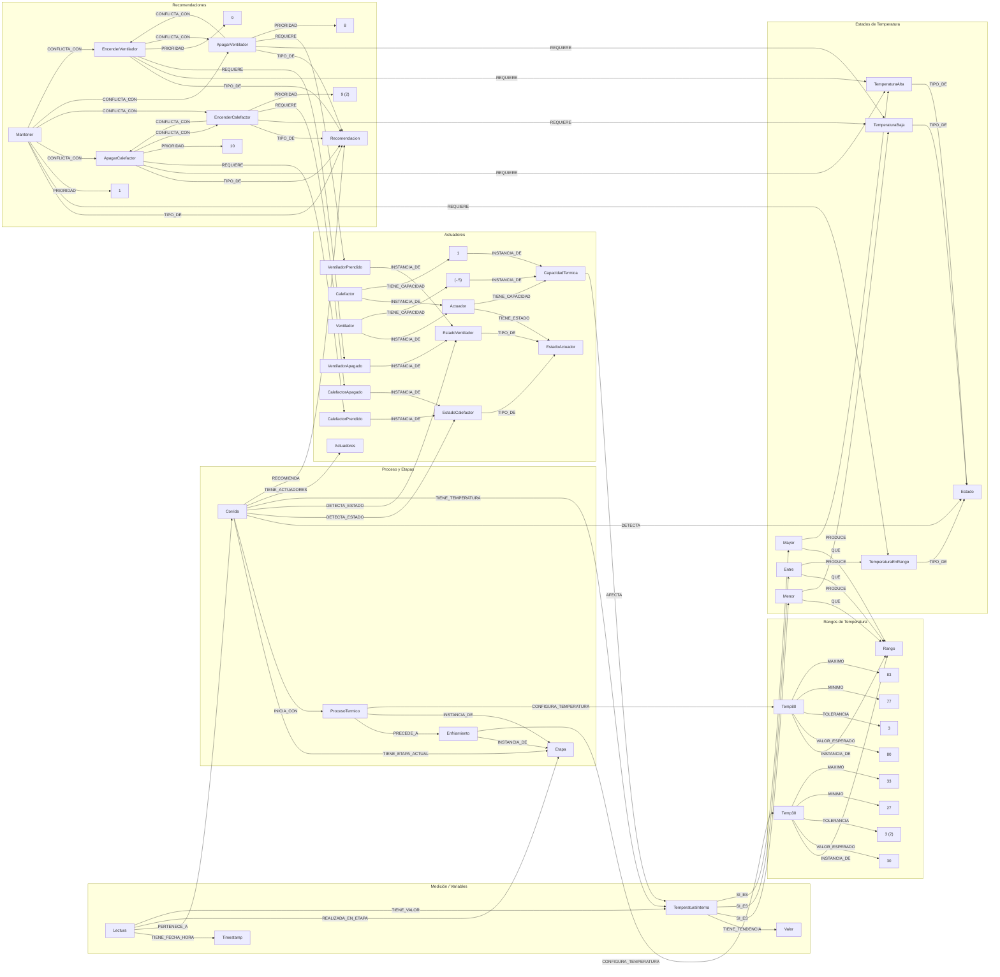

# 1- Objetivo y alcance
  - Objetivo: dado una Corrida en cierta Etapa, clasificar la TemperaturaInterna respecto del Rango de esa etapa y, según el estado resultante y los estados de los actuadores, emitir Recomendaciones de control.
  - Alcance actual: temperatura (diagnóstico de Baja/EnRango/Alta) y acciones sobre Calefactor/Ventilador.
# 2- Ontología: piezas clave del dominio
## Proceso y etapas
  - Corrida-[TIENE_ETAPA_ACTUAL]->Etapa.
  - Cada Etapa-[CONFIGURA_TEMPERATURA]->Rango.
  - Rango define límites por ValorEsperado y Tolerancia, y sus derivados Minimo y Maximo (ej.: ProcesoTermico con 80 ± 3 → 77..83).

## Medición y diagnóstico
  - Corrida-[TIENE_TEMPERATURA]->TemperaturaInterna.
  - Estados de temperatura: TemperaturaBaja, TemperaturaEnRango, TemperaturaAlta.
  - Reglas (comparadores): 
      - TemperaturaInterna-[SI_ES]->Menor/Entre/Mayor
      - Menor/Entre/Mayor-[QUE]->Rango; 
      - Menor/Entre/Mayor-[PRODUCE]->Estado.

    _Nota:_ Interpretación práctica: Menor ≡ T < Minimo; Entre ≡ Minimo < T < Maximo; Mayor ≡ T > Maximo.
## Actuadores y recomendaciones
  - Calefactor y Ventilador son Actuadores con EstadoActuador (Prendido/Apagado) y CapacidadTermica (efecto sobre la temperatura).
  - Recomendaciones: Encender/Apagar cada actuador, Mantener. Se activan mediante la ejecución de las reglas de control: 
    - Recomendación-[REQUIER]->EstadoTemperatura 
    - Recomendación-[REQUIERE]->(estado de actuador), 
    - Recomendación-[TIENE]->PRIORIDAD.

# 3. Flujo de inferencia (paso a paso)
  ## Paso 1: Rango activo
  A partir de la instanciación de la corrida: 
  - Corrida-[TIENE_ETAPA_ACTUAL]->Etapa 
  - Etapa-[CONFIGURA_TEMPERATURA]->Rango

  El motor selecciona el Rango vigente (Minimo/Maximo) para evaluar la temperatura.

  ## Paso 2: Estado de temperatura
  La Corrida obtiene TemperaturaInterna y la clasifica ejecutando las reglas lógicas Menor/Entre/Mayor comparándolas con el Rango.
  
  __Resultado:__ Corrida-[DETECTA]->TemperaturaBaja/EnRango/Alta.

  ## Paso 3: Reglas de control candidatas
  Se activan las Reglas cuya condición [REQUIERE]-> coincide con el estado detectado.
  Cada Regla verifica además [REQUIERE] sobre el actuador (p. ej., “CalefactorPrendido”).

  ## Paso 4: Pesos y umbrales (Si es que lo implementamos)
  ### Umbrales locales por regla:
    UMBRAL_EXCESO: exceso mínimo sobre Maximo para considerar reglas de “Alta”.
    UMBRAL_DEFICIT: déficit mínimo bajo Minimo para “Baja”.
  ### Pesos:
    CONFIANZA en cada regla (0..1): qué tan confiable es la recomendación en ese contexto.
    SEVERIDAD en Estados (opcional, 0..1): impacto relativo de Alta vs. Baja.
  ### Umbral global:
      Corrida-[UMBRAL_DECISION]->x: puntaje mínimo para “emitir” la recomendación.
  ### Forma de cálculo (Orientativo):
      delta = distancia a límite (ej.: T − Maximo si Alta; Minimo − T si Baja; 0 si EnRango).
      pasa_umbral = delta ≥ UMBRAL_EXCESO/DEFICIT (si aplica).
      puntaje_regla = CONFIANZA_regla × SEVERIDAD_estado × f(delta) donde f(delta) puede ser, por ejemplo, min(1, delta/escala).
      Emitir si puntaje_regla ≥ UMBRAL_DECISION.

  ## Paso 5: Resolución de conflictos y priorización
  Si varias reglas producen acciones incompatibles, usar:
  - PRIORIDAD para desempatar.
  - Las aristas CONFLICTA_CON para no emitir pares opuestos (p. ej., EncenderCalefactor vs. ApagarCalefactor).

  ## Paso 6: Emisión y trazabilidad
  Una vez evaluadas las recomendaciones, estas son asignadas a la corrida por medi de la relación Corrida-[RECOMIENDA]->Recomendacion para cada acción aceptada.
  La explicación “por qué” se obtiene recorriendo las relaciones [REQUERE] de la recomendación y los comparadores usados con el Rango.
 
 # 4. Cómo se usan concretamente los pesos/umbrales (Si se implementan)
  En el grafo, se agregan propiedades numéricas a Estados, Reglas y Corrida:
  - Estado: SEVERIDAD (ej., Alta/Baja 0.8; EnRango 0).
  - Regla: CONFIANZA, UMBRAL_EXCESO/UMBRAL_DEFICIT (°C) y, si querés, UMBRAL_ABSOLUTO, VENTANA_TIEMPO para persistencia.
  - Corrida: UMBRAL_DECISION (0..1) como corte global.

  El motor de inferencia lee estos valores para filtrar reglas (por umbral), ponderarlas (por confianza/severidad) y decidir la emisión (por umbral global). Así se reducen falsas alarmas, se jerarquizan acciones y se gana robustez.

# Red semántica 



# Ideas futuras
## 1.Modelar pesos y umbrales como propiedades numéricas en las reglas/estados y un umbral global de decisión en Monitoreo.
- Rango activo: obtener Minimo/Maximo de la Etapa actual de la Corrida.
- Delta térmico:
  - Si TemperaturaAlta: delta = T − Maximo.
  - Si TemperaturaBaja: delta = Minimo − T.
  - Si EnRango: delta = 0.
- Filtrado por regla:
  - Para “Alta”: delta ≥ UMBRAL_EXCESO de la regla.
  - Para “Baja”: delta ≥ UMBRAL_DEFICIT de la regla.
- Puntaje de regla:
  - g(delta) = min(1, delta/escala) (ej.: escala=5 °C).
  - score = CONFIANZA(regla) × SEVERIDAD(estado) × g(delta).
- Decisión:
  - Emitir recomendación si score ≥ UMBRAL_DECISION (de Monitoreo).
  - Resolver conflictos usando PRIORIDAD y CONFLICTA_CON (mantener la de mayor score/prioridad).    

- Pesos y umbrales (decisión)
  ``` 
    -- Severidad por estado térmico (0..1)
    TemperaturaAlta-[SEVERIDAD]->0.8
    TemperaturaBaja-[SEVERIDAD]->0.8
    TemperaturaEnRango-[SEVERIDAD]->0.0

    -- Umbral global para emitir recomendaciones (0..1)
    Monitoreo-[UMBRAL_DECISION]->0.6

    -- Confianza y umbrales locales por regla (°C de exceso/deficit sobre el rango activo)
    Regla_ApagarCalefactor-[CONFIANZA]->0.9
    Regla_ApagarCalefactor-[UMBRAL_EXCESO]->2

    Regla_EncenderVentilador-[CONFIANZA]->0.8
    Regla_EncenderVentilador-[UMBRAL_EXCESO]->1

    Regla_EncenderCalefactor-[CONFIANZA]->0.85
    Regla_EncenderCalefactor-[UMBRAL_DEFICIT]->1

    Regla_ApagarVentilador-[CONFIANZA]->0.75
    Regla_ApagarVentilador-[UMBRAL_DEFICIT]->0.5
  ``` 


## 2. Incorporar el histórico de lecturas de temperatura para análisis de tendencias y detección de fallas.
Esta funcionalidad podría podría modelarse como una métrica que, a partir de un demonio, se obtenga el valor desde una base de datos externa
  ```
  -- Contexto de la lectura (trazabilidad)
  Lectura-[DE_CORRIDA]->Corrida
  Lectura-[EN_ETAPA]->Etapa
  Lectura-[DE_VARIABLE]->TemperaturaInterna  -- aclara qué variable mide

  -- Serie temporal y agregados en ventana
  SerieLecturas
  SerieLecturas-[DE_CORRIDA]->Corrida
  SerieLecturas-[DE_VARIABLE]->TemperaturaInterna
  SerieLecturas-[TIENE_LECTURA]->Lectura
  SerieLecturas-[VENTANA_MIN]->Valor

  -- Metrica
  MaximoVentana-[TIPO_DE]->Metrica
  MinimoVentana-[TIPO_DE]->Metrica
  PromedioVentana-[TIPO_DE]->Metrica
  PendienteVentana-[TIPO_DE]->Metrica      -- °C/min
  DesvioVentana-[TIPO_DE]->Metrica
  TiempoFueraDeRango-[TIPO_DE]->Metrica     -- min
  TiempoEnRango-[TIPO_DE]->Metrica

  SerieLecturas-[CALCULA]->Metrica

  -- Recomendaciones/Alertas adicionales
  AlertaDesviacionPersistente-[TIPO_DE]->Recomendacion
  VerificarSensor-[TIPO_DE]->Recomendacion
  SugerirAvanzarEtapa-[TIPO_DE]->Recomendacion

  -- Umbrales para reglas temporales y de tendencia
  Regla_Alta_Persistente-[TIPO_DE]->Regla
  Regla_Alta_Persistente-[SI]->TemperaturaAlta
  Regla_Alta_Persistente-[VENTANA_TIEMPO]->5      -- min fuera de rango
  Regla_Alta_Persistente-[PRODUCE]->AlertaDesviacionPersistente
  Regla_Alta_Persistente-[CONFIANZA]->0.8
  Regla_Alta_Persistente-[PRIORIDAD]->8

  Regla_Baja_Persistente-[TIPO_DE]->Regla
  Regla_Baja_Persistente-[SI]->TemperaturaBaja
  Regla_Baja_Persistente-[VENTANA_TIEMPO]->5
  Regla_Baja_Persistente-[PRODUCE]->AlertaDesviacionPersistente
  Regla_Baja_Persistente-[CONFIANZA]->0.8
  Regla_Baja_Persistente-[PRIORIDAD]->8

  Regla_Tendencia_Ascendente-[TIPO_DE]->Regla
  Regla_Tendencia_Ascendente-[SI]->TemperaturaEnRango   -- aún en rango, pero subiendo
  Regla_Tendencia_Ascendente-[UMBRAL_PENDIENTE]->0.5    -- °C/min
  Regla_Tendencia_Ascendente-[PRODUCE]->EncenderVentilador
  Regla_Tendencia_Ascendente-[CONFIANZA]->0.7
  Regla_Tendencia_Ascendente-[PRIORIDAD]->6

  -- Sanidad de sensor usando histórico
  Regla_Sensor_Atascado-[TIPO_DE]->Regla
  Regla_Sensor_Atascado-[VENTANA_TIEMPO]->10
  Regla_Sensor_Atascado-[UMBRAL_VAR_MIN]->0.1          -- °C de variación mínima
  Regla_Sensor_Atascado-[PRODUCE]->VerificarSensor
  Regla_Sensor_Atascado-[CONFIANZA]->0.9
  Regla_Sensor_Atascado-[PRIORIDAD]->9

  Regla_Salto_Brusco-[TIPO_DE]->Regla
  Regla_Salto_Brusco-[UMBRAL_SALTO]->5                 -- °C entre lecturas consecutivas
  Regla_Salto_Brusco-[PRODUCE]->VerificarSensor
  Regla_Salto_Brusco-[CONFIANZA]->0.9
  Regla_Salto_Brusco-[PRIORIDAD]->9

  -- Transición de etapa (requiere duración modelada)
  Etapa-[DURACION_MIN]->Valor
  Regla_Avanzar_Etapa-[TIPO_DE]->Regla
  Regla_Avanzar_Etapa-[SI]->TemperaturaEnRango
  Regla_Avanzar_Etapa-[VENTANA_TIEMPO]->30             -- min estable en rango
  Regla_Avanzar_Etapa-[PRODUCE]->SugerirAvanzarEtapa
  Regla_Avanzar_Etapa-[CONFIANZA]->0.8
  Regla_Avanzar_Etapa-[PRIORIDAD]->7
  ``` 

## 3.Enriquecer el control térmico con histéresis, persistencia, límites de seguridad y manejo de sensor.