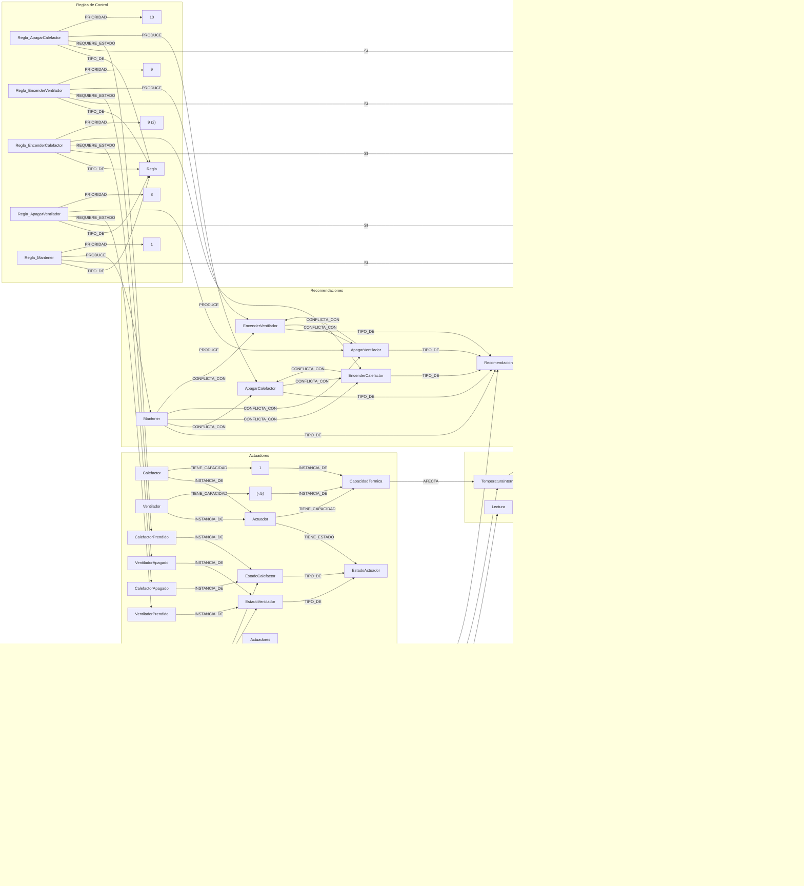

```mermaid
flowchart LR

%% ================== SUBGRAFOS ==================
subgraph SG_PROCESO["Proceso y Etapas"]
  Corrida["Corrida"]
  Etapa["Etapa"]
  ProcesoTermico["ProcesoTermico"]
  Enfriamiento["Enfriamiento"]
end

subgraph SG_RANGOS["Rangos de Temperatura"]
  Rango["Rango"]
  Temp80["Temp80"]
  Temp30["Temp30"]
  V80["80"]
  V30["30"]
  V3a["3"]
  V3b["3 (2)"]
  V77["77"]
  V83["83"]
  V27["27"]
  V33["33"]
end

subgraph SG_MEDICION["Medición / Variables"]
  Lectura["Lectura"]
  TemperaturaInterna["TemperaturaInterna"]
  Valor["Valor"]
end

subgraph SG_ESTADOS_T["Estados de Temperatura"]
  Estado["Estado"]
  TemperaturaAlta["TemperaturaAlta"]
  TemperaturaBaja["TemperaturaBaja"]
  TemperaturaEnRango["TemperaturaEnRango"]
  Menor["Menor"]
  Entre["Entre"]
  Mayor["Mayor"]
end

subgraph SG_ACTUADORES["Actuadores"]
  Actuador["Actuador"]
  Actuadores["Actuadores"]
  EstadoActuador["EstadoActuador"]
  EstadoCalefactor["EstadoCalefactor"]
  EstadoVentilador["EstadoVentilador"]
  CapacidadTermica["CapacidadTermica"]
  Calefactor["Calefactor"]
  Ventilador["Ventilador"]
  UnoCap["1"]
  Menos0_5["(-.5)"]
  CalefactorPrendido["CalefactorPrendido"]
  CalefactorApagado["CalefactorApagado"]
  VentiladorPrendido["VentiladorPrendido"]
  VentiladorApagado["VentiladorApagado"]
end

subgraph SG_RECOM["Recomendaciones"]
  Recomendacion["Recomendacion"]
  ApagarCalefactor["ApagarCalefactor"]
  EncenderCalefactor["EncenderCalefactor"]
  EncenderVentilador["EncenderVentilador"]
  ApagarVentilador["ApagarVentilador"]
  Mantener["Mantener"]
end

subgraph SG_REGLAS["Reglas de Control"]
  Regla["Regla"]
  Regla_ApagarCalefactor["Regla_ApagarCalefactor"]
  Regla_EncenderVentilador["Regla_EncenderVentilador"]
  Regla_EncenderCalefactor["Regla_EncenderCalefactor"]
  Regla_ApagarVentilador["Regla_ApagarVentilador"]
  Regla_Mantener["Regla_Mantener"]
  P10["10"]
  P9a["9"]
  P9b["9 (2)"]
  P8["8"]
  P1["1"]
end

%% ================== RELACIONES DE ETAPAS ==================
Corrida -- "TIENE_ETAPA_ACTUAL" --> Etapa
Corrida -- "INICIA_CON" --> ProcesoTermico
ProcesoTermico -- "PRECEDE_A" --> Enfriamiento
ProcesoTermico -- "INSTANCIA_DE" --> Etapa
Enfriamiento -- "INSTANCIA_DE" --> Etapa

%% ================== RANGOS Y CONFIGURACIÓN ==================
Temp80 -- "INSTANCIA_DE" --> Rango
Temp80 -- "VALOR_ESPERADO" --> V80
Temp80 -- "TOLERANCIA" --> V3a
Temp80 -- "MINIMO" --> V77
Temp80 -- "MAXIMO" --> V83
ProcesoTermico -- "CONFIGURA_TEMPERATURA" --> Temp80

Temp30 -- "INSTANCIA_DE" --> Rango
Temp30 -- "VALOR_ESPERADO" --> V30
Temp30 -- "TOLERANCIA" --> V3b
Temp30 -- "MINIMO" --> V27
Temp30 -- "MAXIMO" --> V33
Enfriamiento -- "CONFIGURA_TEMPERATURA" --> Temp30

%% ================== MEDICIÓN / CORRIDA ==================
Corrida -- "DETECTA" --> Estado
Corrida -- "LEE_TEMPERATURA" --> Lectura
Corrida -- "DETECTA_ESTADO" --> EstadoCalefactor
Corrida -- "DETECTA_ESTADO" --> EstadoVentilador
Corrida -- "TIENE_TEMPERATURA" --> TemperaturaInterna
Corrida -- "TIENE_ACTUADORES" --> Actuadores
TemperaturaInterna -- "TIENE_TENDENCIA" --> Valor

%% ================== ESTADOS TEMPERATURA / DIAGNÓSTICO ==================
TemperaturaAlta -- "TIPO_DE" --> Estado
TemperaturaBaja -- "TIPO_DE" --> Estado
TemperaturaEnRango -- "TIPO_DE" --> Estado

TemperaturaInterna -- "SI_ES" --> Menor
Menor -- "QUE" --> Rango
Menor -- "PRODUCE" --> TemperaturaBaja

TemperaturaInterna -- "SI_ES" --> Entre
Entre -- "QUE" --> Rango
Entre -- "PRODUCE" --> TemperaturaEnRango

TemperaturaInterna -- "SI_ES" --> Mayor
Mayor -- "QUE" --> Rango
Mayor -- "PRODUCE" --> TemperaturaAlta

%% ================== ACTUADORES ==================
Actuador -- "TIENE_ESTADO" --> EstadoActuador
Actuador -- "TIENE_CAPACIDAD" --> CapacidadTermica
EstadoCalefactor -- "TIPO_DE" --> EstadoActuador
EstadoVentilador -- "TIPO_DE" --> EstadoActuador
CapacidadTermica -- "AFECTA" --> TemperaturaInterna

Calefactor -- "INSTANCIA_DE" --> Actuador
UnoCap -- "INSTANCIA_DE" --> CapacidadTermica
Calefactor -- "TIENE_CAPACIDAD" --> UnoCap
CalefactorPrendido -- "INSTANCIA_DE" --> EstadoCalefactor
CalefactorApagado -- "INSTANCIA_DE" --> EstadoCalefactor

Ventilador -- "INSTANCIA_DE" --> Actuador
Menos0_5 -- "INSTANCIA_DE" --> CapacidadTermica
Ventilador -- "TIENE_CAPACIDAD" --> Menos0_5
VentiladorPrendido -- "INSTANCIA_DE" --> EstadoVentilador
VentiladorApagado -- "INSTANCIA_DE" --> EstadoVentilador

%% ================== RECOMENDACIONES ==================
ApagarCalefactor -- "TIPO_DE" --> Recomendacion
EncenderCalefactor -- "TIPO_DE" --> Recomendacion
EncenderVentilador -- "TIPO_DE" --> Recomendacion
ApagarVentilador -- "TIPO_DE" --> Recomendacion
Mantener -- "TIPO_DE" --> Recomendacion
Corrida -- "RECOMIENDA" --> Recomendacion

%% ================== REGLAS DE CONTROL ==================
Regla_ApagarCalefactor -- "TIPO_DE" --> Regla
Regla_ApagarCalefactor -- "SI" --> TemperaturaAlta
Regla_ApagarCalefactor -- "REQUIERE_ESTADO" --> CalefactorPrendido
Regla_ApagarCalefactor -- "PRODUCE" --> ApagarCalefactor
Regla_ApagarCalefactor -- "PRIORIDAD" --> P10

Regla_EncenderVentilador -- "TIPO_DE" --> Regla
Regla_EncenderVentilador -- "SI" --> TemperaturaAlta
Regla_EncenderVentilador -- "REQUIERE_ESTADO" --> VentiladorApagado
Regla_EncenderVentilador -- "PRODUCE" --> EncenderVentilador
Regla_EncenderVentilador -- "PRIORIDAD" --> P9a

Regla_EncenderCalefactor -- "TIPO_DE" --> Regla
Regla_EncenderCalefactor -- "SI" --> TemperaturaBaja
Regla_EncenderCalefactor -- "REQUIERE_ESTADO" --> CalefactorApagado
Regla_EncenderCalefactor -- "PRODUCE" --> EncenderCalefactor
Regla_EncenderCalefactor -- "PRIORIDAD" --> P9b

Regla_ApagarVentilador -- "TIPO_DE" --> Regla
Regla_ApagarVentilador -- "SI" --> TemperaturaBaja
Regla_ApagarVentilador -- "REQUIERE_ESTADO" --> VentiladorPrendido
Regla_ApagarVentilador -- "PRODUCE" --> ApagarVentilador
Regla_ApagarVentilador -- "PRIORIDAD" --> P8

Regla_Mantener -- "TIPO_DE" --> Regla
Regla_Mantener -- "SI" --> TemperaturaEnRango
Regla_Mantener -- "PRODUCE" --> Mantener
Regla_Mantener -- "PRIORIDAD" --> P1

%% ================== CONFLICTOS ==================
ApagarCalefactor -- "CONFLICTA_CON" --> EncenderCalefactor
EncenderCalefactor -- "CONFLICTA_CON" --> ApagarCalefactor
ApagarVentilador -- "CONFLICTA_CON" --> EncenderVentilador
EncenderVentilador -- "CONFLICTA_CON" --> ApagarVentilador
Mantener -- "CONFLICTA_CON" --> ApagarCalefactor
Mantener -- "CONFLICTA_CON" --> EncenderCalefactor
Mantener -- "CONFLICTA_CON" --> ApagarVentilador
Mantener -- "CONFLICTA_CON" --> EncenderVentilador
```