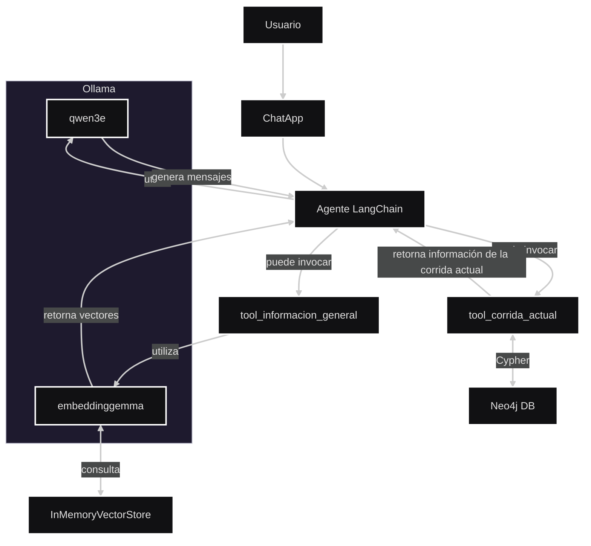

## Asistente mAIllard (chat)

Aplicación de chat con Gradio que usa un agente de LangChain (ChatOllama) con herramientas. La “clasificación” de la intención no es un paso separado: el propio agente decide, mediante prompting y razonamiento, si debe llamar a una tool (por ejemplo, la de corrida actual) o si puede responder directamente.

### Flujo de alto nivel
1) El usuario envía un mensaje en la UI de Gradio.
2) El agente (LangChain + ChatOllama) analiza la consulta y decide internamente si debe invocar una tool.
3) Si corresponde, ejecuta la tool y usa su resultado para redactar la respuesta final; si no, responde directamente.
	- Tools registradas: `tool_corrida_actual` (consulta Neo4j), `tool_informacion_general` (información base).

### Diagrama de componentes (Mermaid)



### Archivos clave
- `main.py`: define la clase `ChatApp` y orquesta las llamadas al agente.
- `agents/ollama_agent.py`: crea el agente de LangChain con `ChatOllama` y registra las tools disponibles.
- `tools/corrida_actual.py`: tool que ejecuta Cypher en Neo4j y devuelve la corrida actual (si existe).
- `tools/informacion_general.py`: tool de información general para respuestas base.
- `utils/config.py`: configuración (Ollama, Neo4j, etc.) leída desde variables de entorno.
- `utils/logger.py`: logger centralizado.

---

## Puesta en marcha

### 1) Instalar dependencias
```bash
cd /workspaces/proyecto/chat
.venv/bin/python -m pip install -r requirements.txt
```

### 2) Asegurarse de que Ollama está corriendo
```bash
docker run -d --gpus=all -v ollama:/root/.ollama -p 11434:11434 --name ollama ollama/ollama
```

Si no tienes GPU, puedes omitir `--gpus=all`.

### 3) Verificar que el/los modelos están disponibles
```bash
docker exec -it ollama ollama run embeddinggemma:latest
docker exec -it ollama ollama run qwen3:4b-instruct
```

> El modelo usado por defecto se controla desde `.env` o `utils/config.py` (variable `OLLAMA_MODEL`).

### 4) Variables de entorno (opcional)
Puedes configurar estas variables en un archivo `.env` en `chat/`:
```env
# Neo4j
NEO4J_URI=neo4j://172.17.0.1:7687
NEO4J_USER=neo4j
NEO4J_PASS=password

# Ollama
OLLAMA_HOST=http://172.17.0.1:11434
OLLAMA_MODEL=llama3.2:latest
OLLAMA_TEMPERATURE=0.7
```

### 5) Ejecutar la aplicación
```bash
.venv/bin/python main.py
```

Por defecto, Gradio se levanta en `http://localhost:7860`.

---

## Cómo decide usar una tool
El agente está instruido para decidir si debe llamar una tool en función de la consulta. Cuando el modelo determina que necesita información externa (por ejemplo, saber si hay una corrida activa), invoca `tool_corrida_actual`, consume el resultado y redacta la respuesta final. Si no requiere herramientas, responde directamente.

---

## Tool: corrida actual
- Archivo: `tools/corrida_actual.py`
- Devuelve una instancia Pydantic `Corrida` con `id` y `etapa`, o `None` si no hay corrida activa.
- Ejecuta un Cypher con `run_cypher(...)` sobre Neo4j para detectar corridas sin `fechaFin`.

---

## Notas
- Puertos por defecto: Gradio 7860, Ollama 11434, Neo4j 7687.
- En entornos Docker/DevContainer, `172.17.0.1` suele apuntar al host; ajusta según tu red.
- Existe un demo RAG opcional en `rag_chroma_demo.py` (usa Chroma + embeddings + modelo HF) para experimentación.