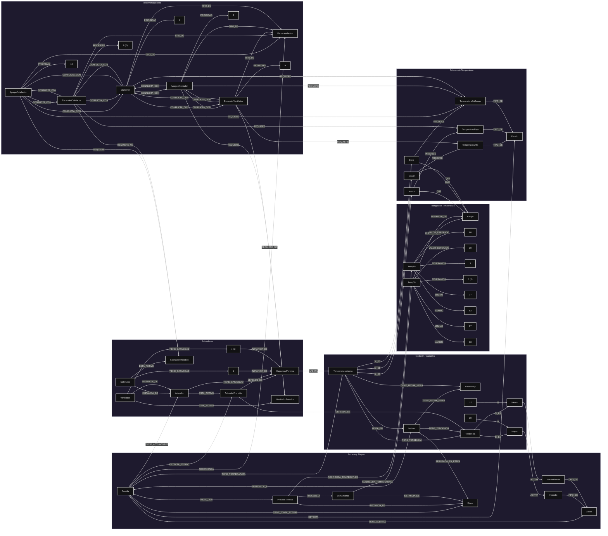

```mermaid
---
config:
  theme: redux-dark
---
flowchart LR

%% ================== SUBGRAFOS ==================
subgraph SG_PROCESO["Proceso y Etapas"]
  Corrida["Corrida"]
  Etapa["Etapa"]
  ProcesoTermico["ProcesoTermico"]
  Enfriamiento["Enfriamiento"]
  Alerta["Alerta"]
  Incendio["Incendio"]
  PuertaAbierta["PuertaAbierta"]
end

subgraph SG_RANGOS["Rangos de Temperatura"]
  Rango["Rango"]
  Temp80["Temp80"]
  Temp30["Temp30"]
  V80["80"]
  V30["30"]
  V3a["3"]
  V3b["3 (2)"]
  V77["77"]
  V83["83"]
  V27["27"]
  V33["33"]
end

subgraph SG_MEDICION["Medición / Variables"]
  Lectura["Lectura"]
  TemperaturaInterna["TemperaturaInterna"]
  Ts["Timestamp"]
  Tendencia["Tendencia"]
  TMayor["Mayor"]
  TMenor["Menor"]
  Tm10["-10"]
  T30["30"]
end

subgraph SG_ESTADOS_T["Estados de Temperatura"]
  Estado["Estado"]
  TemperaturaAlta["TemperaturaAlta"]
  TemperaturaBaja["TemperaturaBaja"]
  TemperaturaEnRango["TemperaturaEnRango"]
  Menor["Menor"]
  Entre["Entre"]
  Mayor["Mayor"]
end

subgraph SG_ACTUADORES["Actuadores"]
  Actuador["Actuador"]
  ActuadorPrendido["ActuadorPrendido"]
  CapacidadTermica["CapacidadTermica"]
  Calefactor["Calefactor"]
  Ventilador["Ventilador"]
  UnoCap["1"]
  Menos0_5["(-.5)"]
  CalefactorPrendido["CalefactorPrendido"]
  VentiladorPrendido["VentiladorPrendido"]
end

subgraph SG_RECOM["Recomendaciones"]
  Recomendacion["Recomendacion"]
  ApagarCalefactor["ApagarCalefactor"]
  EncenderCalefactor["EncenderCalefactor"]
  EncenderVentilador["EncenderVentilador"]
  ApagarVentilador["ApagarVentilador"]
  Mantener["Mantener"]
  P10["10"]
  P9a["9"]
  P9b["9 (2)"]
  P8["8"]
  P1["1"]
end

%% ================== RELACIONES DE ETAPAS ==================
Corrida -- "TIENE_ETAPA_ACTUAL" --> Etapa
Corrida -- "INICIA_CON" --> ProcesoTermico
ProcesoTermico -- "PRECEDE_A" --> Enfriamiento
ProcesoTermico -- "INSTANCIA_DE" --> Etapa
Enfriamiento -- "INSTANCIA_DE" --> Etapa

%% ================== Alertas ==================
Corrida -- "TIENE_ALERTAS" --> Alerta
Incendio -- "TIPO_DE" --> Alerta
PuertaAbierta -- "TIPO_DE" --> Alerta


%% ================== RANGOS Y CONFIGURACIÓN ==================
Temp80 -- "INSTANCIA_DE" --> Rango
Temp80 -- "VALOR_ESPERADO" --> V80
Temp80 -- "TOLERANCIA" --> V3a
Temp80 -- "MINIMO" --> V77
Temp80 -- "MAXIMO" --> V83
ProcesoTermico -- "CONFIGURA_TEMPERATURA" --> Temp80

Temp30 -- "INSTANCIA_DE" --> Rango
Temp30 -- "VALOR_ESPERADO" --> V30
Temp30 -- "TOLERANCIA" --> V3b
Temp30 -- "MINIMO" --> V27
Temp30 -- "MAXIMO" --> V33
Enfriamiento -- "CONFIGURA_TEMPERATURA" --> Temp30

%% ================== MEDICIÓN / CORRIDA ==================
Corrida -- "DETECTA" --> Estado
Corrida -- "DETECTA_ESTADO" --> ActuadorPrendido
Corrida -- "TIENE_TEMPERATURA" --> TemperaturaInterna
Corrida -- "TIENE_ACTUADORES" --> Actuador
TemperaturaInterna -- "TIENE_TENDENCIA" --> Tendencia
Lectura -- "TIENE_FECHA_HORA" --> Ts
Lectura -- "PERTENECE_A" --> Corrida
Lectura -- "REALIZADA_EN_ETAPA" --> Etapa
Lectura -- "TIENE_TENDENCIA" --> Tendencia
TemperaturaInterna -- "LEIDA_EN" --> Lectura
TemperaturaInterna -- "TIENE_FECHA_HORA" --> Ts
Tendencia -- "SI_ES" --> TMayor
T30 -- "A" --> TMayor
Tendencia -- "SI_ES" --> TMenor
Tm10 -- "A" --> TMenor
TMayor -- "ACTIVA" --> Incendio
TMenor -- "ACTIVA" --> PuertaAbierta


%% ================== ESTADOS TEMPERATURA / DIAGNÓSTICO ==================
TemperaturaAlta -- "TIPO_DE" --> Estado
TemperaturaBaja -- "TIPO_DE" --> Estado
TemperaturaEnRango -- "TIPO_DE" --> Estado

TemperaturaInterna -- "SI_ES" --> Menor
Menor -- "QUE" --> Rango
Menor -- "PRODUCE" --> TemperaturaBaja

TemperaturaInterna -- "SI_ES" --> Entre
Entre -- "QUE" --> Rango
Entre -- "PRODUCE" --> TemperaturaEnRango

TemperaturaInterna -- "SI_ES" --> Mayor
Mayor -- "QUE" --> Rango
Mayor -- "PRODUCE" --> TemperaturaAlta

%% ================== ACTUADORES ==================
Actuador -- "ESTA_ACTIVO" --> ActuadorPrendido
Actuador -- "TIENE_CAPACIDAD" --> CapacidadTermica
CapacidadTermica -- "AFECTA" --> TemperaturaInterna
ActuadorPrendido -- "DEPENDE_DE" --> CapacidadTermica
ActuadorPrendido -- "DEPENDE_DE" --> Tendencia

Calefactor -- "INSTANCIA_DE" --> Actuador
UnoCap -- "INSTANCIA_DE" --> CapacidadTermica
Calefactor -- "TIENE_CAPACIDAD" --> UnoCap
Calefactor -- "ESTA_ACTIVO" --> CalefactorPrendido

Ventilador -- "INSTANCIA_DE" --> Actuador
Menos0_5 -- "INSTANCIA_DE" --> CapacidadTermica
Ventilador -- "TIENE_CAPACIDAD" --> Menos0_5
Ventilador -- "ESTA_ACTIVO" --> VentiladorPrendido


%% ================== RECOMENDACIONES ==================
ApagarCalefactor -- "TIPO_DE" --> Recomendacion
EncenderCalefactor -- "TIPO_DE" --> Recomendacion
EncenderVentilador -- "TIPO_DE" --> Recomendacion
ApagarVentilador -- "TIPO_DE" --> Recomendacion
Mantener -- "TIPO_DE" --> Recomendacion
Corrida -- "RECOMIENDA" --> Recomendacion

%% ================== REGLAS DE CONTROL ==================

ApagarCalefactor -- "REQUIERE" --> TemperaturaEnRango
ApagarCalefactor -- "REQUIERE" --> CalefactorPrendido
ApagarCalefactor -- "PRIORIDAD" --> P10

EncenderVentilador -- "REQUIERE" --> TemperaturaAlta
EncenderVentilador -- "REQUIERE_NO" --> VentiladorPrendido
EncenderVentilador -- "PRIORIDAD" --> P9a

EncenderCalefactor -- "REQUIERE" --> TemperaturaBaja
EncenderCalefactor -- "REQUIERE_NO" --> CalefactorPrendido
EncenderCalefactor -- "PRIORIDAD" --> P9b

ApagarVentilador -- "REQUIERE" --> TemperaturaEnRango
ApagarVentilador -- "REQUIERE" --> VentiladorPrendido
ApagarVentilador -- "PRIORIDAD" --> P8

Mantener -- "REQUIERE" --> TemperaturaEnRango
Mantener -- "PRIORIDAD" --> P1

%% ================== CONFLICTOS ==================
ApagarCalefactor -- "CONFLICTA_CON" --> EncenderCalefactor
ApagarCalefactor -- "CONFLICTA_CON" --> Mantener
EncenderCalefactor -- "CONFLICTA_CON" --> ApagarCalefactor
EncenderCalefactor -- "CONFLICTA_CON" --> Mantener
ApagarVentilador -- "CONFLICTA_CON" --> EncenderVentilador
ApagarVentilador -- "CONFLICTA_CON" --> Mantener
EncenderVentilador -- "CONFLICTA_CON" --> ApagarVentilador
EncenderVentilador -- "CONFLICTA_CON" --> Mantener
Mantener -- "CONFLICTA_CON" --> ApagarCalefactor
Mantener -- "CONFLICTA_CON" --> EncenderCalefactor
Mantener -- "CONFLICTA_CON" --> ApagarVentilador
Mantener -- "CONFLICTA_CON" --> EncenderVentilador
```